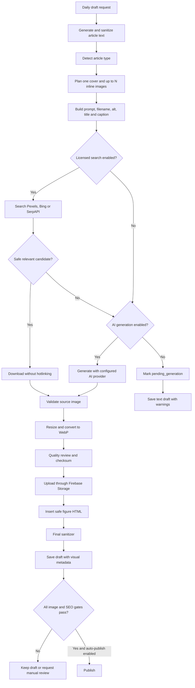

# OpenClaw Blog Image Pipeline

## Overview

The Visual SEO pipeline extends the existing HMAC-protected SEO blog automation route. It does not add a public endpoint and does not change the draft-only default.

Pipeline:

1. Detect article type and build one cover plan plus 2-4 heading-linked inline plans.
2. Build realistic editorial prompts and negative visual guardrails.
3. Search an optional licensed-image provider.
4. Fall back to an optional AI image provider.
5. Validate MIME type, dimensions, size, source, license, relevance, and forbidden styles.
6. Convert accepted images to WebP with `sharp`.
7. Upload through the existing Firebase Storage service under `blog/YYYY/MM/{slug}/`.
8. Insert accepted inline images as semantic `figure` HTML.
9. Sanitize the final HTML and save the draft with image metadata and warnings.

If any image step fails, the text article is still saved. The visual plan and `pending_generation` metadata remain available for a later retry or manual upload.

## Flow Diagram



## Safety And Publishing

- `SEO_AGENT_AUTO_PUBLISH=false` always forces draft mode.
- `OPENCLAW_REQUIRE_COVER_IMAGE_FOR_PUBLISH=true` blocks automated publishing unless the cover status is `complete`.
- AI-generated images are saved as `needs_review` and cannot satisfy the automated cover gate.
- Publisher agents have no shell, browser, MongoDB, or admin UI access.
- External SVG files, placeholders, unknown-license search results, fake badges, fake certifications, and forbidden CGI-style prompts are rejected.
- Unsplash search metadata can be queried, but its results are not re-hosted because the Unsplash API requires hotlinking and this pipeline prohibits hotlinking.

## Image Standards

- Cover planning master: 1600x900.
- Stored cover: 1200x675 WebP.
- Optional OG target: 1200x630.
- Inline images: up to 1200x800 or 1200x675 WebP.
- Default maximum stored image size: 350 KB.
- Filenames use the article slug and image purpose.
- Alt text is descriptive, limited to 160 characters, and checked for keyword stuffing.

## Environment Variables

```dotenv
OPENCLAW_IMAGE_PIPELINE_ENABLED=true
OPENCLAW_REQUIRE_COVER_IMAGE_FOR_PUBLISH=true

IMAGE_SEARCH_PROVIDER=disabled
IMAGE_SEARCH_API_KEY=

AI_IMAGE_PROVIDER=disabled
AI_IMAGE_API_KEY=

IMAGE_MAX_INLINE_COUNT=4
IMAGE_COVER_WIDTH=1200
IMAGE_COVER_HEIGHT=675
IMAGE_OG_WIDTH=1200
IMAGE_OG_HEIGHT=630
IMAGE_MAX_FILE_SIZE_KB=350
```

Optional provider settings:

```dotenv
AI_IMAGE_MODEL=gpt-image-2
AI_IMAGE_QUALITY=medium
AI_IMAGE_REPLICATE_MODEL=owner/model
BING_IMAGE_SEARCH_ENDPOINT=https://api.bing.microsoft.com/v7.0/images/search
IMAGE_PROVIDER_TIMEOUT_MS=15000
IMAGE_GENERATION_TIMEOUT_MS=120000
IMAGE_MAX_SOURCE_FILE_SIZE_KB=10240
```

Supported search values: `disabled`, `pexels`, `unsplash`, `bing`, `serpapi`.

Supported generation values: `disabled`, `openai`, `stability`, `replicate`.

Do not commit provider keys. Configure them only in the local/VPS `.env`.

## Local Testing With Providers Disabled

Use:

```dotenv
OPENCLAW_IMAGE_PIPELINE_ENABLED=true
IMAGE_SEARCH_PROVIDER=disabled
AI_IMAGE_PROVIDER=disabled
SEO_AGENT_AUTO_PUBLISH=false
```

Run a daily draft from the OpenClaw admin dashboard. Expected result:

- text draft is created;
- `imagePipelineStatus` is `pending`;
- cover and inline metadata use `pending_generation`;
- response contains provider-disabled warnings;
- no provider network request or image charge occurs.

The blog editor shows the image status, alt text, caption, generated cover when available, and a valid fallback for legacy `/images/og-image.png` records.

## Testing A Provider

Pexels example:

```dotenv
IMAGE_SEARCH_PROVIDER=pexels
IMAGE_SEARCH_API_KEY=replace-on-host
AI_IMAGE_PROVIDER=disabled
```

OpenAI image example:

```dotenv
IMAGE_SEARCH_PROVIDER=disabled
AI_IMAGE_PROVIDER=openai
AI_IMAGE_API_KEY=replace-on-host
AI_IMAGE_MODEL=gpt-image-2
```

AI output remains `needs_review`. Use **Duyệt ảnh** or **Từ chối** in the blog editor after visual inspection. Uploading a replacement cover marks the new asset as `manual_upload` and removes the stale AI cover from the preview. Provider requests may incur costs.

## Cost-Saving Profile

For low-volume local testing:

```dotenv
IMAGE_SEARCH_PROVIDER=pexels
AI_IMAGE_PROVIDER=openai
AI_IMAGE_MODEL=gpt-image-2
AI_IMAGE_QUALITY=low
IMAGE_MAX_INLINE_COUNT=2
SEO_AGENT_AUTO_PUBLISH=false
```

The pipeline searches Pexels first and calls OpenAI only when no licensed candidate passes review. With the current limit, one article plans at most one cover and two inline images.

Operational steps:

1. Open **OpenClaw AI** and confirm `IMAGE_SEARCH` and `AI_IMAGE` show configured providers with `set`.
2. Run **Chạy daily draft**.
3. Open the new draft from **Bài viết**.
4. Inspect the cover, alt text, caption, and inline-image placement.
5. For AI covers, click **Duyệt ảnh** or **Từ chối**.
6. Keep the article as draft until content and visual review are complete.

## Stored Metadata

Blog records now support:

- `coverImage`
- `contentImages`
- `visualPlan`
- `imagePipelineStatus`

Metadata includes URL, storage path, alt, title, caption, dimensions, MIME type, size, source type, source URL, license, author, prompt, model, checksum, status, and quality-review results.

## ClawHub

Local visual skills are stored under `deploy/openclaw/skills`.

Verified and installed locally:

- `google-search-console-seo` 1.0.5
- `sharpagent-content-safety` 1.0.0

Considered but not installed:

- `seo-audit`: OpenClaw verification failed because its ClawHub skill card was missing.
- Image quality search returned no direct ClawHub match, so repository-local quality rules are used.

On the VPS:

```bash
bash scripts/openclaw/install-skills.sh
bash scripts/openclaw/sync-agents.sh
openclaw --profile inoxpran skills check
openclaw --profile inoxpran agents list
```

Never add a ClawHub skill to a publisher allowlist without inspect and verify passing.

## Copyright And Licensing

Web image search is not permission to use every returned image. The pipeline accepts only candidates with explicit license metadata and stores source attribution. Confirm the provider license and intended commercial use before publishing. Do not use random Google Images.

## VPS Deployment

1. Back up MongoDB and the current `.env`.
2. Pull the branch and review the diff.
3. Add the Visual SEO variables to the VPS `.env`.
4. Keep both providers `disabled` for the first deployment.
5. Run backend tests and frontend build.
6. Run `docker compose config`.
7. Rebuild backend/frontend containers.
8. Run the skill installer and agent sync inside the configured OpenClaw environment.
9. Create one draft and verify `pending_generation`.
10. Enable one provider at a time and create another draft.
11. Review storage paths, attribution, image dimensions, WebP size, inline placement, and publish blocking.

Nginx requires no new route. The OpenClaw dashboard remains private.

## Rollback

Fast rollback:

```dotenv
OPENCLAW_IMAGE_PIPELINE_ENABLED=false
SEO_AGENT_AUTO_PUBLISH=false
```

Restart the backend. Text draft creation continues and no provider is called.

Full rollback:

1. Deploy the previous application revision.
2. Keep the new MongoDB fields; older code ignores them.
3. Remove newly installed OpenClaw skills only if they are not used elsewhere.
4. Do not delete uploaded images until storage references have been audited.

## Known Limitations

- No computer-vision model is called for semantic inspection; AI images therefore require human review.
- OG dimensions are configured but a separate OG artifact is not uploaded because the current blog model has no dedicated OG image convention.
- Unsplash results are intentionally skipped for storage because its API hotlinking requirement conflicts with the no-hotlink policy.
- Replicate requires `AI_IMAGE_REPLICATE_MODEL`.
- Search Console requires its own OAuth setup and does not affect draft generation.
- Existing drafts with only the fallback image do not gain a topic-specific cover automatically.
